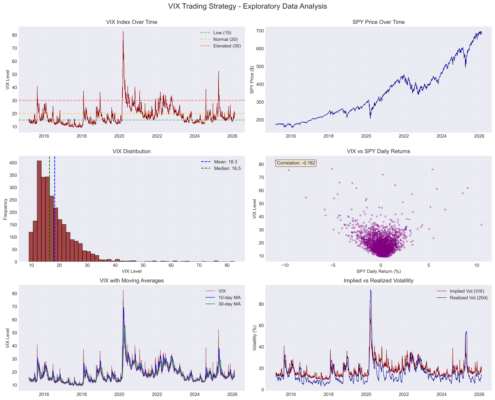
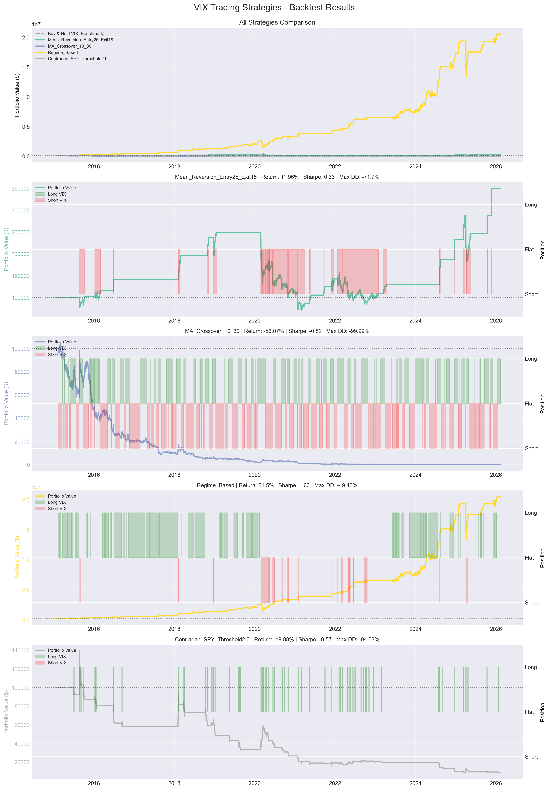
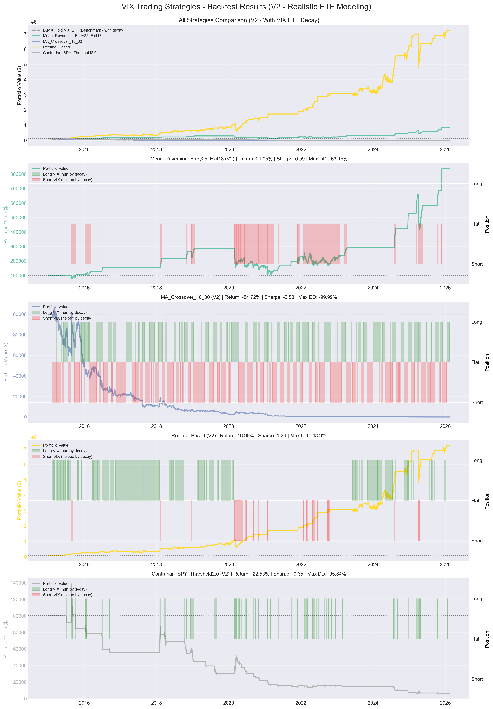
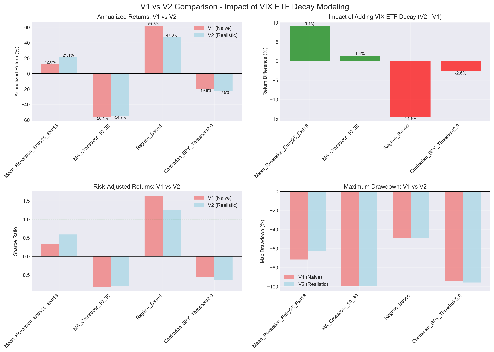
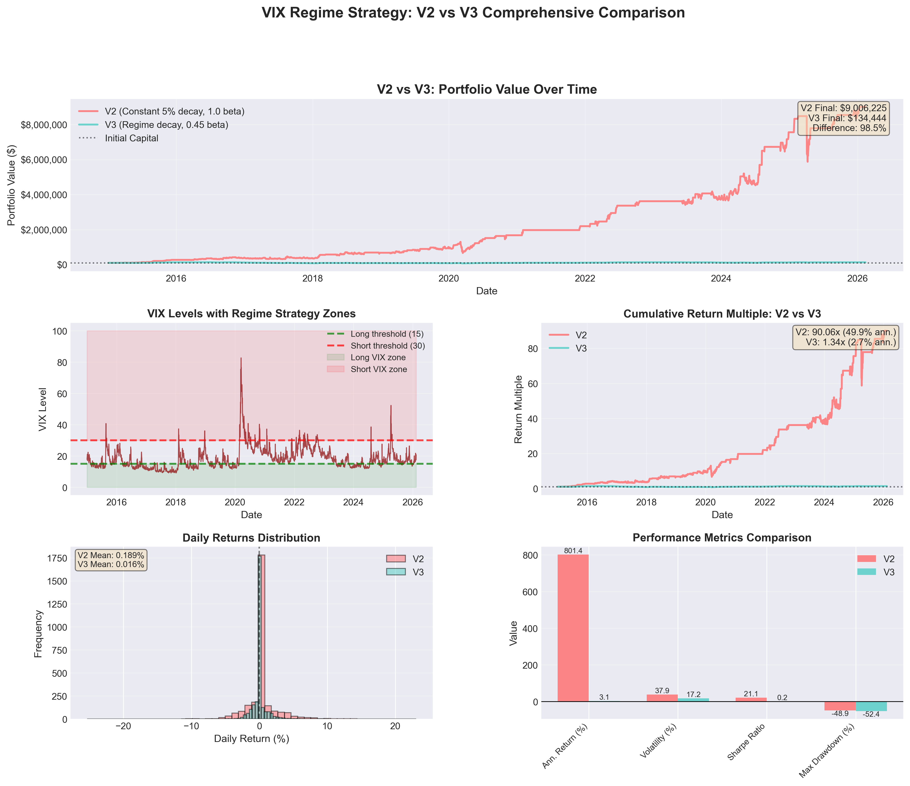

# Results: VIX Trading Strategy Backtest

This document summarizes the outputs generated by the VIX Trading Strategy project.  
All results are reproducible using the scripts in this repository.

---

# Key Finding

A naive volatility trading backtest appears highly profitable under unrealistic assumptions.

After progressively incorporating realistic market mechanics:

- VIX ETF beta vs spot VIX
- Regime-dependent contango/backwardation decay
- Transaction costs and slippage
- Realistic signal execution

**Annualized returns dropped from ~61.5% → ~2.7%**

This represents a **98.5% reduction** in performance once realistic assumptions are applied.

**Conclusion:**  
Ignoring market microstructure and ETF mechanics can dramatically overstate strategy performance.

---

# Generated Visual Outputs

After running the analysis scripts, the following images will be created in the project root or `/images` folder.

## Exploratory Analysis
**File:** `images/exploratory_analysis.png`

Shows:
- VIX vs SPY relationships
- Volatility regimes
- Distribution of returns
- Signal behavior



---

## Naive Backtest (V1)
**File:** `images/backtesting.png`

This chart shows results from the **initial naive strategy** using simplified assumptions:

- Direct VIX signal trading
- No realistic ETF decay modeling
- Minimal transaction costs
- No regime awareness

**Observation:**  
The equity curve appears highly profitable and stable, suggesting strong returns (~61.5% annualized).  
However, these results rely on unrealistic assumptions about how VIX-linked ETFs behave.

This serves as the baseline demonstration of how volatility strategies can look deceptively profitable.



---

## Improved Backtest with added VIX ETF Decay (V2)
**File:** `images/backtesting_v2.png`

This version introduces more realistic mechanics:

- Added ~5% monthly structural decay to model VIX ETF contango
- More realistic trade behavior

**Observation:**  
Returns drop compared to the naive model.  
This demonstrates how accounting for decay materially impacts performance.

Still optimistic, but far more realistic than V1.



---

## Backtest Performance Comparison
**File:** `images/backtest_comparison.png` *(or your generated filename)*

Shows:
- V1 naive strategy equity curve
- V2 improved model

Highlights the dramatic reduction in returns after realistic modeling.



---

## V2 vs V3 Comprehensive Strategy Comparison
**File:** `images/v2_v3_comparison.png`

This multi-panel visualization provides a full comparison between the improved model (V2) and the final realistic regime-based model (V3).

**Top Panel — Portfolio Value Over Time**  
Displays equity curves for both strategies.  
- V2 shows extremely high growth driven by simplified assumptions.  
- V3 shows far more modest growth under realistic ETF decay, beta, and regime modeling.  
The gap highlights how small modeling changes dramatically affect long-term performance.

**Middle Left — VIX Regime Zones**  
Shows VIX levels with trading thresholds and regime regions:
- Long-volatility zone when VIX is low  
- Short-volatility zone when VIX is elevated  
This explains how regime-based signals are generated in V3.

**Middle Right — Cumulative Return Multiple**  
Compares total return multiples:
- V2 reaches extremely high cumulative returns  
- V3 grows slowly and realistically  
Demonstrates how unrealistic decay assumptions inflate strategy performance.

**Bottom Left — Daily Returns Distribution**  
Histogram comparing daily return distributions:
- V2 has higher mean returns but wider dispersion  
- V3 has tighter, more realistic return clustering  
Shows reduced volatility and lower expected return under realistic modeling.

**Bottom Right — Performance Metrics Comparison**  
Bar chart comparing:
- Annual return
- Volatility
- Sharpe ratio
- Maximum drawdown

Key takeaway:  
While V2 appears highly profitable with strong Sharpe ratios,  
V3 reflects more realistic risk-adjusted performance and significantly lower returns.

This visualization summarizes the central conclusion of the project:  
**Proper modeling of ETF mechanics and volatility regimes is critical for realistic backtesting.**



---

# Generated CSV Outputs

These files are created when running the backtesting scripts.

| File | Description |
|------|-------------|
| `vix_spy_data.csv` | Cleaned historical VIX + SPY dataset |
| `v1_v2_comparison.csv` | Comparison of v1 and v2 |
| `v2_v3_comparison.csv` | Comparison of v2 and v3 |

These CSVs allow independent verification of results and further analysis.

---

# How to Reproduce Results

Run the full pipeline:

```bash
python data_collection.py
python exploratory_analysis.py
python backtesting.py
python backtesting_v2.py
python compare_v1_v2.py
python regime_based_v3.py
```
